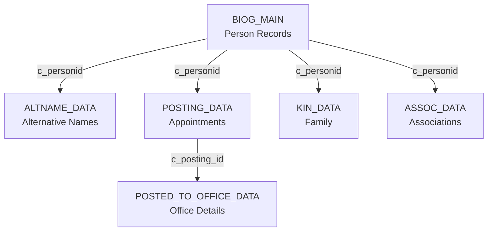

## Database Architecture

CBDB Online uses **MariaDB 10.3.39** in production with SQLite for testing environments. The database follows a normalized relational model with extensive foreign key constraints to maintain data integrity.

### Technical Specifications

| Aspect | Details |
|--------|----------|
| **Production DBMS** | MariaDB 10.3.39 (Debian) |
| **Test DBMS** | SQLite (in-memory for CI/CD) |
| **Character Set** | utf8mb4 |
| **Collation** | utf8mb4_general_ci |
| **Timezone** | GMT+8 (Asia/Shanghai) |

<Warning>
All migrations must be compatible with both MySQL/MariaDB and SQLite. Use Laravel Schema Builder whenever possible, and avoid database-specific features.
</Warning>

## Core Tables Overview

### Person Records

<CardGroup cols={2}>
  <Card title="BIOG_MAIN" icon="user">
    **Primary person table**
    
    Stores core biographical data for each historical figure including names, dates, dynasty, and geographic associations.
    
    Primary Key: `c_personid`
  </Card>
  
  <Card title="ALTNAME_DATA" icon="tags">
    **Alternative names**
    
    Stores zi (字), hao (號), and other name variants for persons.
    
    Composite Key: `c_personid`, `c_sequence`, `c_alt_name_chn`, `c_alt_name_type_code`
  </Card>
</CardGroup>

### Offices and Positions

<CardGroup cols={2}>
  <Card title="POSTING_DATA" icon="briefcase">
    **Appointment records**
    
    Core table for official career appointments.
    
    Primary Key: `c_posting_id`
  </Card>
  
  <Card title="POSTED_TO_OFFICE_DATA" icon="building">
    **Office details**
    
    Links postings to specific offices with dates and locations.
    
    Composite Key: `c_personid`, `c_posting_id`, `c_office_id`
  </Card>
  
  <Card title="POSTED_TO_ADDR_DATA" icon="map-pin">
    **Office addresses**
    
    Geographic locations associated with office postings.
    
    Composite Key: `c_personid`, `c_posting_id`, `c_office_id`
  </Card>
  
  <Card title="OFFICE_CODES" icon="list">
    **Office catalog**
    
    Standardized list of official positions and titles.
    
    Primary Key: `c_office_id`
  </Card>
</CardGroup>

### Social Relationships

<CardGroup cols={2}>
  <Card title="KIN_DATA" icon="users">
    **Kinship relations**
    
    Family relationships between persons (parent, spouse, sibling, etc.).
    
    Composite Key: `c_personid`, `c_kin_id`, `c_kin_code`
  </Card>
  
  <Card title="ASSOC_DATA" icon="handshake">
    **Social associations**
    
    Non-kinship relationships (teacher, friend, colleague, etc.).
    
    Composite Key: `c_personid`, `c_assoc_id`, `c_assoc_code`
  </Card>
</CardGroup>

### Reference and Lookup Tables

<Card title="Code Tables" icon="table">
  The database includes numerous code tables for standardized values:
  
  - `ADDR_CODES` - Geographic locations
  - `DYNASTIES` - Historical dynasties
  - `NIAN_HAO` - Era names (年號)
  - `ETHNICITY_TRIBE_CODES` - Ethnic groups
  - `KINSHIP_CODES` - Types of kinship relations
  - `ASSOC_CODES` - Types of social associations
  - `TEXT_CODES` - Source texts and references
  - `YEAR_RANGE_CODES` - Date uncertainty indicators
  - `GANZHI_CODES` - Traditional cyclical calendar (干支)
  
  See `config/codes.php` for the complete list.
</Card>

## Key Relationships

### Person-Centric Model



### Office Posting Relationships

<Steps>
  <Step title="Posting Created">
    Entry in `POSTING_DATA` created with unique `c_posting_id`
  </Step>
  
  <Step title="Office Assignment">
    Link to specific office via `POSTED_TO_OFFICE_DATA` (person + posting + office)
  </Step>
  
  <Step title="Location Data">
    Geographic information stored in `POSTED_TO_ADDR_DATA` using same composite key
  </Step>
</Steps>

## Internal Helper Tables

CBDB uses internal tables with the `CBDB__` prefix for system functionality:

<CardGroup cols={2}>
  <Card title="CBDB__NAME_FTS" icon="magnifying-glass">
    **Name search index**
    
    Inverted index for efficient name searching, supports suffix matching.
    
    Read-only in UI (`/codes/CBDB__NAME_FTS`)
  </Card>
  
  <Card title="CBDB__TRAD_SIMP_MAP" icon="language">
    **Character mapping**
    
    Traditional/Simplified Chinese character mapping and variant normalization.
    
    Based on OpenCC standards, uses VARBINARY(4) for non-BMP characters.
  </Card>
</CardGroup>

<Note>
Internal tables are marked read-only in the `/codes` interface and should only be modified through dedicated services.
</Note>

## Composite Primary Keys

<Warning>
**Important**: Laravel Eloquent does not officially support composite primary keys. For tables with composite keys, use Query Builder (`DB::table()`) instead of Eloquent models.
</Warning>

Tables with composite primary keys include:

| Table | Composite Key Fields |
|-------|---------------------|
| `ALTNAME_DATA` | `c_personid`, `c_sequence`, `c_alt_name_chn`, `c_alt_name_type_code` |
| `POSTED_TO_OFFICE_DATA` | `c_personid`, `c_posting_id`, `c_office_id` |
| `POSTED_TO_ADDR_DATA` | `c_personid`, `c_posting_id`, `c_office_id` |
| `KIN_DATA` | `c_personid`, `c_kin_id`, `c_kin_code` |
| `ASSOC_DATA` | `c_personid`, `c_assoc_id`, `c_assoc_code` |

### Working with Composite Keys

```php
// ✅ Correct: Use Query Builder for composite key tables
DB::table('ALTNAME_DATA')
    ->where('c_personid', $personId)
    ->where('c_sequence', $sequence)
    ->update(['c_alt_name_chn' => $newName]);

// ❌ Wrong: Don't create Eloquent models for composite key tables
// Eloquent's delete(), update(), and find() methods won't work properly
```

## Foreign Key Constraints

The database enforces referential integrity through extensive foreign key constraints:

```sql
-- Example: BIOG_MAIN references multiple code tables
CONSTRAINT `BIOG_MAIN_ibfk_6` 
  FOREIGN KEY (`c_dy`) 
  REFERENCES `DYNASTIES` (`c_dy`) 
  ON DELETE CASCADE ON UPDATE CASCADE
```

<Tip>
When creating migrations, remember to:
- Drop foreign keys before modifying indexed columns
- Re-add foreign keys after schema changes
- Ensure referenced code tables are populated before inserting data
</Tip>

## Schema Management

### Baseline Migration

The complete schema is imported via baseline migration:

```
database/migrations/2025_01_01_000000_import_cbdb_schema.php
```

<Warning>
**Do not modify** the baseline migration file. Create new incremental migrations for schema changes.
</Warning>

### Creating New Migrations

```bash
# Create a new migration
php artisan make:migration add_column_to_biog_main
```

Follow the [migration guide](/.claude/skills/migration-guide.md) to ensure MySQL/SQLite compatibility.

## Querying the Schema

### Get Table Structure

```php
// In tinker or code
use Illuminate\Support\Facades\Schema;

// Get column listing
$columns = Schema::getColumnListing('BIOG_MAIN');

// Get column details
$columnType = Schema::getColumnType('BIOG_MAIN', 'c_personid');
```

### View Table Relationships

```sql
-- Show foreign keys for a table
SELECT 
    CONSTRAINT_NAME,
    COLUMN_NAME,
    REFERENCED_TABLE_NAME,
    REFERENCED_COLUMN_NAME
FROM INFORMATION_SCHEMA.KEY_COLUMN_USAGE
WHERE TABLE_NAME = 'BIOG_MAIN'
    AND REFERENCED_TABLE_NAME IS NOT NULL;
```

## Database Compatibility

### Core Principles

<CardGroup cols={2}>
  <Card title="Use Standard SQL" icon="check">
    Avoid vendor-specific syntax and functions
  </Card>
  
  <Card title="Laravel Schema Builder" icon="check">
    Use migrations instead of raw SQL when possible
  </Card>
  
  <Card title="No Vendor Lock-in" icon="xmark">
    Avoid MySQL FULLTEXT, ngram parser, or MariaDB-specific plugins
  </Card>
  
  <Card title="Test on SQLite" icon="check">
    Verify migrations work on SQLite: `php artisan migrate --database=sqlite`
  </Card>
</CardGroup>

### Helper Functions

Use these helper functions in migrations for database detection:

```php
// database/migrations/helpers.php

if (is_mysql()) {
    // MySQL/MariaDB specific logic
    DB::statement('ALTER TABLE example ADD INDEX ...');
}

if (is_sqlite()) {
    // Skip MySQL-only syntax like COMMENT, ENGINE, USING BTREE
}
```

<Note>
**Do not use** `DB::getDriverName()` directly. Always use the `is_mysql()` and `is_sqlite()` helpers.
</Note>

## System Tables

CBDB Online includes Laravel-specific tables:

| Table | Purpose |
|-------|----------|
| `users` | User accounts and authentication |
| `operations` | Operation audit log (see [Operations Audit](/concepts/operations-audit)) |
| `password_resets` | Password reset tokens |
| `personal_access_tokens` | API tokens (Laravel Sanctum) |
| `pinyin` | Chinese surname to pinyin mapping |

## Performance Considerations

### Indexes

The schema includes extensive B-Tree indexes:

```sql
-- Example from BIOG_MAIN
KEY `c_personid_BIOG_MAIN_index` (`c_personid`) USING BTREE,
KEY `c_dy` (`c_dy`),
KEY `c_ethnicity_code_BIOG_MAIN_index` (`c_ethnicity_code`) USING BTREE
```

<Tip>
B-Tree indexes are excellent for:
- Exact matches (`WHERE c_dy = 5`)
- Range queries (`WHERE c_birthyear BETWEEN 1000 AND 1100`)
- Prefix searches (`WHERE c_name_chn LIKE '王%'`)

But ineffective for:
- Mid-string searches (`WHERE c_name_chn LIKE '%安石%'`)
</Tip>

### Query Optimization

Use the `/admin/explainsql` tool (admin-only) to analyze query execution plans:

```sql
EXPLAIN SELECT * FROM BIOG_MAIN 
WHERE c_dy = 5 AND c_birthyear > 1000;
```

## Data Integrity

### Audit Logging

All data modifications are logged in the `operations` table:

```php
use App\Repositories\OperationRepository;

$operationRepo = new OperationRepository();
$operationRepo->store(
    user_id: Auth::id(),
    c_personid: $personId,
    op_type: 2, // 1=create, 2=update, 3=restore, 4=delete
    resource: 'BIOG_MAIN',
    resource_id: (string) $personId,
    resource_data: $newData,
    ori: $oldData
);
```

See [Operations Audit](/concepts/operations-audit) for more details.

### Cascade Behavior

Most foreign keys use `ON DELETE CASCADE ON UPDATE CASCADE`:

```sql
CONSTRAINT `ALTNAME_DATA_ibfk_1` 
  FOREIGN KEY (`c_personid`) 
  REFERENCES `BIOG_MAIN` (`c_personid`) 
  ON DELETE CASCADE ON UPDATE CASCADE
```

<Warning>
Deleting a person from `BIOG_MAIN` will cascade delete all related records in `ALTNAME_DATA`, `POSTING_DATA`, `KIN_DATA`, etc.
</Warning>

## See Also

- [Biographical Records](/concepts/biographical-records) - Detailed BIOG_MAIN structure
- [User Roles](/concepts/user-roles) - Permission system
- [Operations Audit](/concepts/operations-audit) - Change tracking system
- DATABASE.md (source) - Complete database documentation
