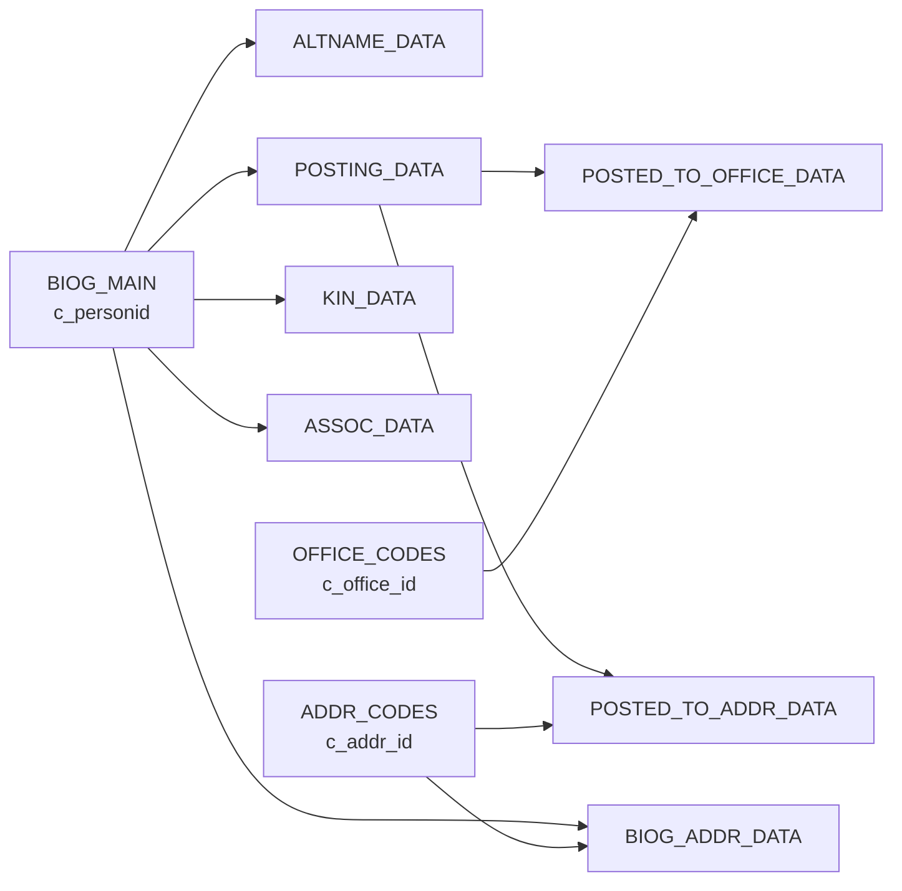

## Overview

CBDB Online's database schema consists of 100+ tables organized around biographical data, locations, offices, associations, and code tables. This guide covers the most important tables you'll work with.

<Note>
  The complete database schema was imported via the baseline migration `2025_01_01_000000_import_cbdb_schema.php`. All subsequent schema changes are managed through incremental Laravel migrations.
</Note>

## Core Biographical Tables

### BIOG_MAIN

The central table containing basic biographical information for all individuals.

<Card title="Primary Key" icon="key">
  `c_personid` (int)
</Card>

**Key Columns**:

<Tabs>
  <Tab title="Names">
    | Column | Type | Description |
    |--------|------|-------------|
    | `c_personid` | int | Primary key, unique person identifier |
    | `c_name` | varchar(255) | Romanized name |
    | `c_name_chn` | varchar(255) | Chinese name |
    | `c_surname` | varchar(255) | Romanized surname |
    | `c_surname_chn` | varchar(255) | Chinese surname |
    | `c_mingzi` | varchar(255) | Romanized given name |
    | `c_mingzi_chn` | varchar(255) | Chinese given name |
  </Tab>
  
  <Tab title="Dates">
    | Column | Type | Description |
    |--------|------|-------------|
    | `c_birthyear` | smallint | Birth year (Western calendar) |
    | `c_deathyear` | smallint | Death year (Western calendar) |
    | `c_index_year` | int | Index year for sorting |
    | `c_by_nh_code` | smallint | Birth year nianhao code |
    | `c_dy_nh_code` | smallint | Death year nianhao code |
  </Tab>
  
  <Tab title="Demographics">
    | Column | Type | Description |
    |--------|------|-------------|
    | `c_female` | smallint | Gender indicator (0=male, 1=female) |
    | `c_ethnicity_code` | smallint | Ethnicity code |
    | `c_household_status_code` | smallint | Household status |
    | `c_dy` | smallint | Dynasty code |
    | `c_index_addr_id` | int | Primary address |
  </Tab>
</Tabs>

**Usage Example**:

```php
// Single primary key - use Eloquent
use App\Models\BiogMain;

$person = BiogMain::find($personId);
echo $person->c_name_chn; // Display Chinese name
```

### ALTNAME_DATA

Alternate names (字, 號, 別稱, etc.) for individuals.

<Warning>
  **Composite Primary Key**: This table uses a composite primary key. Use Query Builder, not Eloquent.
</Warning>

<Card title="Primary Key" icon="key">
  `(c_personid, c_alt_name_chn, c_alt_name_type_code)`
</Card>

**Key Columns**:

| Column | Type | Description |
|--------|------|-------------|
| `c_personid` | int | Reference to BIOG_MAIN |
| `c_alt_name` | varchar(255) | Romanized alternate name |
| `c_alt_name_chn` | varchar(255) | Chinese alternate name |
| `c_alt_name_type_code` | smallint | Name type code (字, 號, etc.) |
| `c_sequence` | smallint | Sequence number |

**Usage Example**:

```php
// Composite primary key - use Query Builder
DB::table('ALTNAME_DATA')
    ->where('c_personid', $personId)
    ->where('c_alt_name_type_code', $typeCode)
    ->get();
```

## Office and Posting Tables

### OFFICE_CODES

Official position titles across dynasties.

<Card title="Primary Key" icon="key">
  `c_office_id` (int)
</Card>

**Key Columns**:

| Column | Type | Description |
|--------|------|-------------|
| `c_office_id` | int | Unique office identifier |
| `c_office_chn` | varchar(255) | Chinese office name |
| `c_office_pinyin` | varchar(255) | Pinyin romanization |
| `c_office_trans` | varchar(255) | English translation |
| `c_dy` | smallint | Dynasty code |

### POSTING_DATA

Records of individuals holding offices.

<Card title="Primary Key" icon="key">
  `(c_personid, c_posting_id)`
</Card>

**Key Columns**:

| Column | Type | Description |
|--------|------|-------------|
| `c_personid` | int | Reference to BIOG_MAIN |
| `c_posting_id` | int | Unique posting identifier |
| `c_firstyear` | smallint | Start year of posting |
| `c_lastyear` | smallint | End year of posting |
| `c_source` | int | Source text reference |

### POSTED_TO_OFFICE_DATA

Links postings to specific offices.

<Card title="Primary Key" icon="key">
  `(c_personid, c_posting_id, c_office_id)`
</Card>

**Key Columns**:

| Column | Type | Description |
|--------|------|-------------|
| `c_personid` | int | Reference to BIOG_MAIN |
| `c_posting_id` | int | Reference to POSTING_DATA |
| `c_office_id` | int | Reference to OFFICE_CODES |
| `c_appt_type_code` | smallint | Appointment type |

### POSTED_TO_ADDR_DATA

Links postings to locations where the office was held.

<Card title="Primary Key" icon="key">
  `(c_personid, c_posting_id, c_office_id)`
</Card>

**Key Columns**:

| Column | Type | Description |
|--------|------|-------------|
| `c_personid` | int | Reference to BIOG_MAIN |
| `c_posting_id` | int | Reference to POSTING_DATA |
| `c_office_id` | int | Reference to OFFICE_CODES |
| `c_addr_id` | int | Reference to ADDR_CODES |

<Note>
  These three tables (POSTING_DATA, POSTED_TO_OFFICE_DATA, POSTED_TO_ADDR_DATA) work together to represent the complete picture of an official appointment. Always update them atomically within a database transaction.
</Note>

## Location Tables

### ADDR_CODES

Geographic locations and administrative units.

<Card title="Primary Key" icon="key">
  `c_addr_id` (int)
</Card>

**Key Columns**:

| Column | Type | Description |
|--------|------|-------------|
| `c_addr_id` | int | Unique location identifier |
| `c_name` | varchar(255) | Romanized location name |
| `c_name_chn` | varchar(255) | Chinese location name |
| `c_admin_type` | varchar(255) | Administrative type (府, 縣, etc.) |
| `c_firstyear` | smallint | First year of existence |
| `c_lastyear` | smallint | Last year of existence |
| `x_coord` | double | X coordinate |
| `y_coord` | double | Y coordinate |

### BIOG_ADDR_DATA

Links individuals to locations (birthplace, residence, etc.).

<Card title="Primary Key" icon="key">
  `(c_personid, c_addr_id, c_addr_type, c_sequence)`
</Card>

**Key Columns**:

| Column | Type | Description |
|--------|------|-------------|
| `c_personid` | int | Reference to BIOG_MAIN |
| `c_addr_id` | int | Reference to ADDR_CODES |
| `c_addr_type` | smallint | Address type code |
| `c_sequence` | int | Sequence number |

## Association Tables

### ASSOC_DATA

Records relationships and associations between individuals.

<Warning>
  **Composite Primary Key**: Uses a large composite key with 9 columns. Always use Query Builder.
</Warning>

<Card title="Primary Key" icon="key">
  `(c_assoc_code, c_personid, c_kin_code, c_kin_id, c_assoc_id, c_assoc_kin_code, c_assoc_kin_id, c_assoc_first_year, c_text_title)`
</Card>

**Key Columns**:

| Column | Type | Description |
|--------|------|-------------|
| `c_assoc_code` | smallint | Type of association |
| `c_personid` | int | Primary person |
| `c_assoc_id` | int | Associated person |
| `c_assoc_first_year` | int | Start year of association |
| `c_source` | int | Source text reference |

### KIN_DATA

Kinship relationships between individuals.

<Card title="Primary Key" icon="key">
  `(c_personid, c_kin_id, c_kin_code)`
</Card>

**Key Columns**:

| Column | Type | Description |
|--------|------|-------------|
| `c_personid` | int | Reference to BIOG_MAIN |
| `c_kin_id` | int | Related person |
| `c_kin_code` | smallint | Kinship relationship code |

## Code Tables

Code tables provide lookup values for various fields. They follow the naming pattern `*_CODES`.

<CardGroup cols={2}>
  <Card title="DYNASTIES" icon="crown">
    Dynasty codes and date ranges
    
    - `c_dy` (primary key)
    - `c_dynasty_chn` (Chinese name)
    - `c_start`, `c_end` (years)
  </Card>
  
  <Card title="NIAN_HAO" icon="calendar">
    Imperial reign titles
    
    - `c_nianhao_id` (primary key)
    - `c_nianhao_chn` (Chinese name)
    - `c_firstyear`, `c_lastyear`
  </Card>
  
  <Card title="KINSHIP_CODES" icon="users">
    Kinship relationship types
    
    - `c_kincode` (primary key)
    - `c_kinrel_chn` (Chinese term)
    - `c_kinrel` (English term)
  </Card>
  
  <Card title="ASSOC_CODES" icon="handshake">
    Association types
    
    - `c_assoc_code` (primary key)
    - `c_assoc_desc_chn` (Chinese)
    - `c_assoc_desc` (English)
  </Card>
</CardGroup>

### Accessing Code Tables

All code tables are accessible via the `/codes/{table}` route:

```
/codes/DYNASTIES
/codes/NIAN_HAO
/codes/KINSHIP_CODES
/codes/OFFICE_CODES
```

<Tip>
  Code tables are whitelisted in `config/codes.php`. See `CODES_TABLES.md` for the complete list.
</Tip>

## Internal Tables

Tables with the `CBDB__` prefix are internal auxiliary tables not directly exposed to end users.

### CBDB__NAME_FTS

Name search inverted index for efficient suffix matching.

<Card title="Primary Key" icon="key">
  `id` (bigint, auto-increment)
</Card>

**Key Columns**:

| Column | Type | Description |
|--------|------|-------------|
| `c_personid` | int | Reference to BIOG_MAIN |
| `search_term` | varchar(100) | Searchable name segment |
| `full_name` | varchar(100) | Complete name |
| `name_type_code` | smallint | Name type reference |
| `source` | varchar(32) | Source table (BIOG_MAIN, ALTNAME_DATA) |
| `is_simplified` | boolean | Simplified Chinese variant |

**Indexes**:

- `idx_cbdb__name_search_term` on `(search_term, c_personid)`
- `idx_cbdb__name_person` on `c_personid`

### CBDB__TRAD_SIMP_MAP

Traditional-Simplified Chinese character mapping.

<Card title="Primary Key" icon="key">
  `trad_char` (varbinary(4))
</Card>

**Columns**:

| Column | Type | Description |
|--------|------|-------------|
| `trad_char` | varbinary(4) | Traditional character (UTF-8 binary) |
| `simp_char` | varbinary(4) | Simplified character (UTF-8 binary) |

<Note>
  Uses VARBINARY(4) to handle 4-byte UTF-8 characters and avoid MySQL 8.0 utf8mb4 BMP character primary key index bugs.
</Note>

## Table Relationships

Key foreign key relationships:



## Common Query Patterns

### Finding a Person

```php
// Single primary key - use Eloquent
$person = BiogMain::find($personId);
```

### Getting Alternate Names

```php
// Composite primary key - use Query Builder
$altNames = DB::table('ALTNAME_DATA')
    ->where('c_personid', $personId)
    ->orderBy('c_sequence')
    ->get();
```

### Finding Offices Held

```php
$offices = DB::table('POSTING_DATA as pd')
    ->join('POSTED_TO_OFFICE_DATA as ptod', function ($join) {
        $join->on('pd.c_personid', '=', 'ptod.c_personid')
             ->on('pd.c_posting_id', '=', 'ptod.c_posting_id');
    })
    ->join('OFFICE_CODES as oc', 'ptod.c_office_id', '=', 'oc.c_office_id')
    ->where('pd.c_personid', $personId)
    ->select('oc.c_office_chn', 'pd.c_firstyear', 'pd.c_lastyear')
    ->get();
```

## Schema Updates

<Warning>
  **Never modify the baseline migration** (`2025_01_01_000000_import_cbdb_schema.php`). All schema changes must be made through new incremental migrations.
</Warning>

To add or modify tables:

1. Create a new migration: `php artisan make:migration add_new_column_to_table`
2. Use Laravel Schema Builder for maximum compatibility
3. Test on both MySQL and SQLite
4. Document changes in the migration file

See [Migrations](/database/migrations) for detailed guidance.

## Next Steps

<CardGroup cols={2}>
  <Card 
    title="Database Migrations" 
    icon="code" 
    href="/database/migrations"
  >
    Learn how to create and modify database schema
  </Card>
  
  <Card 
    title="Compatibility Guide" 
    icon="check-double" 
    href="/database/compatibility"
  >
    Understand MySQL/SQLite compatibility requirements
  </Card>
</CardGroup>