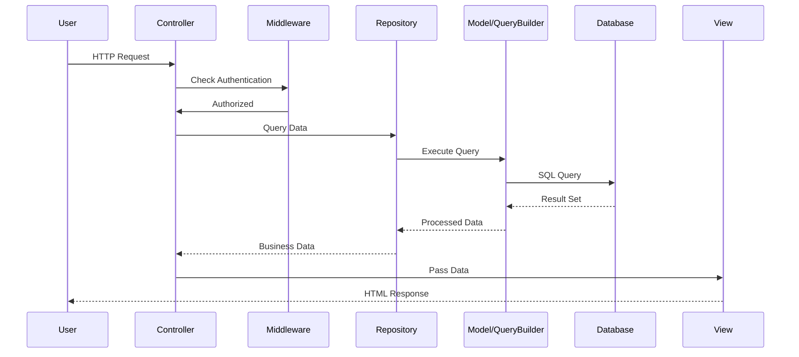

## Overview

CBDB Online is built on a modern PHP web application architecture using Laravel 12 framework. The system follows established design patterns and best practices for maintainability and scalability.

## Core Architecture Pattern

### MVC (Model-View-Controller)

The application follows Laravel's MVC pattern:

<CardGroup cols={3}>
  <Card title="Model" icon="database">
    Eloquent ORM models in `app/Models/` handle data structure and relationships
  </Card>
  <Card title="View" icon="eye">
    Blade templates in `resources/views/` render the user interface
  </Card>
  <Card title="Controller" icon="gears">
    Controllers in `app/Http/Controllers/` handle request logic and responses
  </Card>
</CardGroup>

### Repository Pattern

The system implements the **Repository Pattern** to separate data access logic from business logic:

```
Controller → Repository → Model/Query Builder → Database
```

<Note>
  Repository classes in `app/Repositories/` encapsulate all database operations, making the codebase more maintainable and testable.
</Note>

**Key benefits:**
- Centralizes data access logic
- Easier to test controllers with mocked repositories
- Consistent API for data operations across the application
- Better separation of concerns

See [Repository Pattern](/dev/repository-pattern) for detailed implementation guide.

## Directory Structure

### Application Layer (`app/`)

<Steps>
  <Step title="Controllers (app/Http/Controllers/)">
    Handle HTTP requests, validate input, call repositories, and return responses.
    
    **Examples:**
    - `BiogBasicInformationController.php` - Person basic information CRUD
    - `OperationsController.php` - Operation logs and restore functionality
    - `CodesController.php` - Generic code table management
  </Step>
  
  <Step title="Repositories (app/Repositories/)">
    Encapsulate all database access logic and complex queries.
    
    **Examples:**
    - `BiogMainRepository.php` - Person data operations
    - `OperationRepository.php` - Operation log storage
    - `CodesRepository.php` - Code table queries
  </Step>
  
  <Step title="Models (app/Models/)">
    Eloquent ORM models representing database tables.
    
    **Important:** Only used for tables with **single primary keys**. Tables with composite primary keys use Query Builder directly.
    
    **Examples:**
    - `BiogMain.php` - Person basic information
    - `Operation.php` - Operation logs
    - `User.php` - User accounts
  </Step>
  
  <Step title="Services (app/Services/)">
    Business logic and specialized operations.
    
    **Examples:**
    - `NameSearchIndexService.php` - Name search indexing
    - `VariantCharNormalizer.php` - Chinese variant character normalization
    - `AuditLogService.php` - Audit logging
  </Step>
</Steps>

### View Layer (`resources/`)

<Card title="Blade Templates" icon="code">
  **Location:** `resources/views/`
  
  - All pages use `layouts/dashboard-v3.blade.php` base layout
  - AdminLTE 3 (Bootstrap 4) components
  - Organized by functional modules (e.g., `basicinformation/`, `operations/`)
</Card>

<Card title="Frontend Assets" icon="vuejs">
  **Location:** `resources/js/`
  
  - Built with **Vite** (replaces Laravel Mix)
  - Entry points: `app.js` (UI components), `datatables.js` (DataTables)
  - Vue 3 components in `resources/js/components/`
  - jQuery exposed globally via `jquery-global.js`
</Card>

### Configuration (`config/`)

Key configuration files:

| File | Purpose |
|------|----------|
| `database.php` | Database connections (MySQL, SQLite for testing) |
| `codes.php` | `/codes/*` route whitelist for generic code table pages |
| `view_tables.php` | View table definitions and queries |
| `app.php` | Application settings (timezone: GMT+8) |

### Database Layer (`database/`)

<CardGroup cols={2}>
  <Card title="Migrations" icon="arrows-turn-right">
    **Location:** `database/migrations/`
    
    - Baseline migration: `2025_01_01_000000_baseline_schema.php`
    - Must be compatible with both MySQL/MariaDB and SQLite
    - Use helper functions: `is_mysql()`, `is_sqlite()`
  </Card>
  
  <Card title="Factories" icon="industry">
    **Location:** `database/factories/`
    
    - User factory for testing
    - Generate test data for PHPUnit tests
  </Card>
</CardGroup>

### Testing (`tests/`)

<CardGroup cols={2}>
  <Card title="Feature Tests">
    **Location:** `tests/Feature/`
    
    Full application tests including HTTP requests, database interactions, and user authentication.
  </Card>
  
  <Card title="Unit Tests">
    **Location:** `tests/Unit/`
    
    Isolated component tests for repositories, services, and models.
  </Card>
</CardGroup>

<Tip>
  All tests use **in-memory SQLite** for fast, reliable testing without external database dependencies.
</Tip>

## Data Flow Example

### Typical Request Flow



### Example: Viewing a Person's Information

<Steps>
  <Step title="User visits /basicinformation/{personid}">
    Route defined in `routes/web.php`
  </Step>
  
  <Step title="BiogBasicInformationController@show">
    Controller receives request
  </Step>
  
  <Step title="BiogMainRepository::byPersonId()">
    Repository queries database
  </Step>
  
  <Step title="BiogMain Model + Eager Loading">
    Eloquent loads person data with related records (addresses, offices, etc.)
  </Step>
  
  <Step title="Return to Controller">
    Repository returns processed data
  </Step>
  
  <Step title="Render View">
    Controller passes data to `basicinformation/show.blade.php`
  </Step>
</Steps>

## Database Access Patterns

### Single Primary Key Tables

**Use Eloquent Models:**

```php
// app/Models/BiogMain.php
class BiogMain extends Model {
    protected $table = 'BIOG_MAIN';
    protected $primaryKey = 'c_personid';
    // ...
}

// In Repository
$person = BiogMain::find($personId);
```

### Composite Primary Key Tables

<Warning>
  Laravel Eloquent **does not officially support composite primary keys**. Use Query Builder instead.
</Warning>

**Use Query Builder:**

```php
// For tables like ALTNAME_DATA (c_personid + c_sequence + ...)
$altname = DB::table('ALTNAME_DATA')
    ->where('c_personid', $personId)
    ->where('c_sequence', $sequence)
    ->first();
```

**Examples of composite primary key tables:**
- `ALTNAME_DATA` (alternative names)
- `POSTED_TO_ADDR_DATA` (office posting addresses)
- `POSTED_TO_OFFICE_DATA` (office postings)

## Internal Helper Tables

Tables prefixed with `CBDB__` are internal system tables:

<CardGroup cols={2}>
  <Card title="CBDB__NAME_FTS" icon="magnifying-glass">
    Name search inverted index for efficient suffix matching queries
  </Card>
  
  <Card title="CBDB__TRAD_SIMP_MAP" icon="language">
    Traditional/Simplified Chinese character mapping and variant normalization (based on OpenCC)
  </Card>
</CardGroup>

<Note>
  Internal tables are read-only in the `/codes/*` interface and are automatically maintained by the system.
</Note>

## Related Documentation

<CardGroup cols={2}>
  <Card title="Tech Stack" href="/dev/tech-stack" icon="layer-group">
    Detailed version information for all technologies used
  </Card>
  
  <Card title="Repository Pattern" href="/dev/repository-pattern" icon="box">
    Implementation guide for the Repository pattern
  </Card>
  
  <Card title="Testing" href="/dev/testing" icon="flask">
    PHPUnit testing strategy and best practices
  </Card>
  
  <Card title="Database Setup" href="/setup/database" icon="database">
    Database configuration and migration guide
  </Card>
</CardGroup>