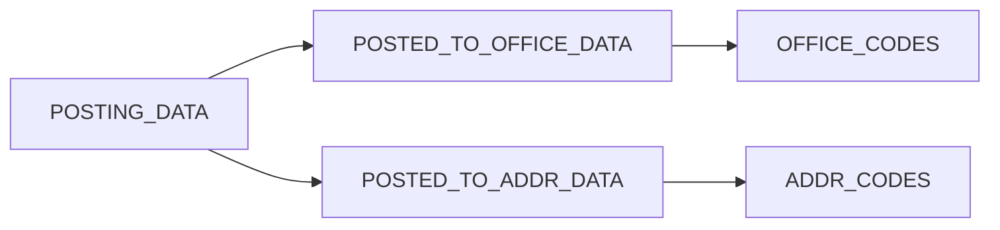

## Overview

Office postings (任官記錄) record government appointments, official positions, and career history for historical Chinese figures. CBDB Online uses three related tables to store comprehensive office posting information:

- **POSTING_DATA**: Core posting record with dates and appointment type
- **POSTED_TO_OFFICE_DATA**: Links posting to specific office(s)
- **POSTED_TO_ADDR_DATA**: Associates posting with geographic location(s)

This three-table structure allows a single posting to reference multiple offices and locations.

## Understanding Office Postings

### Key Concepts

<CardGroup cols={2}>
  <Card title="Office Codes" icon="table-list">
    Standardized government positions from `OFFICE_CODES` table
  </Card>
  <Card title="Posting Record" icon="file-lines">
    A single appointment event with dates and context
  </Card>
  <Card title="Multiple Offices" icon="building-columns">
    One posting can reference multiple concurrent positions
  </Card>
  <Card title="Geographic Context" icon="map-location-dot">
    Locations associated with the office(s)
  </Card>
</CardGroup>

### Data Structure



## Adding Office Postings

<Steps>
  <Step title="Navigate to person's detail page">
    Go to `/basicinformation/{personid}` and scroll to the "Office Postings" section.
  </Step>
  <Step title="Click 'Add New Office Posting'">
    This opens the office posting creation form.
  </Step>
  <Step title="Enter posting information">
    **Required fields:**
    - **Person ID** (`c_personid`): Automatically filled
    - **Office(s)** (`c_office_id`): Select one or more offices from dropdown
    
    **Optional but recommended:**
    - **First Year** (`c_firstyear`): Start year of appointment
    - **Last Year** (`c_lastyear`): End year of appointment
    - **Appointment Type** (`c_appt_type_code`): Type of appointment
    - **Assumption of Office** (`c_assum_office_code`): Whether person took office
    - **Source** (`c_source`): Source of information
    - **Notes** (`c_notes`): Additional context
  </Step>
  <Step title="Add locations (optional)">
    For each selected office, you can add associated locations:
    - Select place from `ADDR_CODES`
    - Specify time period for this location
  </Step>
  <Step title="Save posting">
    Click "Save" to create the posting record. The system will:
    - Generate `c_posting_id` automatically
    - Create entries in all three tables
    - Log the operation for audit trail
  </Step>
</Steps>

<Note>
The system uses **database transactions** to ensure all three tables are updated atomically. If any part fails, all changes are rolled back.
</Note>

## Editing Office Postings

### Edit Form

<Steps>
  <Step title="Navigate to edit page">
    From the person's detail page, click "Edit" next to the posting, or go to:
    ```
    /basicinformation/{personid}/offices/{c_office_id}-{c_posting_id}/edit
    ```
  </Step>
  <Step title="Modify posting details">
    Update any fields as needed:
    - Change dates (first year, last year)
    - Add or remove offices
    - Modify appointment type
    - Update notes
  </Step>
  <Step title="Update locations">
    Add, remove, or modify associated locations in the `POSTED_TO_ADDR_DATA` section.
  </Step>
  <Step title="Save changes">
    Click "Save" to commit changes. The system will:
    - Update timestamp only if `POSTED_TO_OFFICE_DATA` changed
    - Log operation with before/after JSON
    - Preserve address changes in operation log
  </Step>
</Steps>

### Repository Implementation

Office posting operations use `BiogMainRepository` methods:

```php office operations
// Create new office posting
$this->biogMainRepository->officeStoreById($personId, [
    'c_office_id' => $officeId,
    'c_firstyear' => 1050,
    'c_lastyear' => 1060,
    'c_appt_type_code' => 1,
    'addresses' => [
        ['c_addr_id' => 12345, 'c_firstyear' => 1050],
        ['c_addr_id' => 67890, 'c_firstyear' => 1055],
    ],
]);

// Update existing office posting
$this->biogMainRepository->officeUpdateById(
    $personId,
    $officeId,
    $postingId,
    $updatedData
);

// Delete office posting
$this->biogMainRepository->officeDeleteById(
    $personId,
    $officeId,
    $postingId
);
```

<Warning>
All office posting operations must use the repository methods, not direct database queries. This ensures proper transaction handling and audit logging.
</Warning>

## Composite Primary Keys

Office posting tables use composite primary keys:

### POSTED_TO_OFFICE_DATA
- Primary Key: `(c_personid, c_posting_id, c_office_id)`
- Use **Query Builder** (`DB::table()`), not Eloquent

### POSTED_TO_ADDR_DATA
- Primary Key: `(c_personid, c_posting_id, c_office_id, c_addr_id, c_firstyear)`
- Use **Query Builder** (`DB::table()`), not Eloquent

<Tip>
For URL routing with composite keys, CBDB Online uses a special encoding format:
```
{c_office_id}-{c_posting_id}
```
Example: `/basicinformation/12345/offices/920-1234/edit`
</Tip>

## Operation Logging

### What Gets Logged

Office posting operations are logged with:

- **Operation Type**: 1 (create), 2 (update), 3 (restore), 4 (delete)
- **Resource Type**: "Office/Posting Data"
- **Resource ID**: `{c_office_id}-{c_posting_id}`
- **Resource Data**: JSON with:
  - `office`: Data from `POSTED_TO_OFFICE_DATA`
  - `rows`: Array of addresses from `POSTED_TO_ADDR_DATA`

### Example Operation Log Entry

```json operation log
{
  "op_type": 2,
  "resource_type": "Office/Posting Data",
  "resource_id": "920-1234",
  "resource_data": {
    "office": {
      "c_personid": 12345,
      "c_posting_id": 1234,
      "c_office_id": 920,
      "c_firstyear": 1050,
      "c_lastyear": 1060
    },
    "rows": [
      {
        "c_personid": 12345,
        "c_posting_id": 1234,
        "c_office_id": 920,
        "c_addr_id": 12345,
        "c_firstyear": 1050
      }
    ]
  }
}
```

## Code Tables

Office postings reference several code tables:

<CardGroup cols={2}>
  <Card title="OFFICE_CODES" icon="building" href="/guides/code-tables">
    Government positions and offices
  </Card>
  <Card title="APPT_TYPE_CODES" icon="stamp">
    Types of appointments (regular, acting, concurrent)
  </Card>
  <Card title="ASSUMP_OFFICE_CODES" icon="door-open">
    Whether person actually assumed the office
  </Card>
  <Card title="ADDR_CODES" icon="map" href="/guides/code-tables">
    Geographic locations
  </Card>
</CardGroup>

## Best Practices

<AccordionGroup>
  <Accordion title="Date Entry">
    - Use `c_firstyear` for appointment start date
    - Use `c_lastyear` for appointment end date (optional)
    - Leave blank if exact dates unknown
    - Use nian hao (reign periods) for precise dating when possible
  </Accordion>
  
  <Accordion title="Multiple Offices">
    - One posting can reference multiple concurrent offices
    - Each office gets separate entry in `POSTED_TO_OFFICE_DATA`
    - Share same `c_posting_id` for concurrent offices
  </Accordion>
  
  <Accordion title="Geographic Associations">
    - Add locations in `POSTED_TO_ADDR_DATA` for offices with specific places
    - Can have different time periods for different locations
    - Locations are optional if office is not place-specific
  </Accordion>
  
  <Accordion title="Data Quality">
    - Always include source information when available
    - Use notes field for context or uncertainties
    - Verify office codes against `OFFICE_CODES` table
    - Check dynasty compatibility (office should exist in that dynasty)
  </Accordion>
</AccordionGroup>

## Troubleshooting

<Accordion title="Why can't I save my office posting?">
  Common issues:
  - Selected office doesn't exist in `OFFICE_CODES`
  - Date range conflicts with dynasty period
  - Missing required fields
  - Invalid composite key combination
  
  Check browser console for validation errors.
</Accordion>

<Accordion title="Changes not showing in operations log?">
  - Only `POSTED_TO_OFFICE_DATA` changes update the timestamp
  - Pure address changes don't update the main posting timestamp
  - Check operation log's `resource_data.rows` for address changes
</Accordion>

<Accordion title="How do I restore a deleted posting?">
  Only experts and administrators can restore deleted postings:
  1. Go to `/operations`
  2. Find the delete operation (op_type = 4)
  3. Click "Restore" button
  4. Confirm restoration
  
  The system will create a new record based on the logged data.
</Accordion>

## Related Documentation

<CardGroup cols={2}>
  <Card title="Code Tables" icon="table" href="/guides/code-tables">
    Manage office codes and reference tables
  </Card>
  <Card title="Operations Audit" icon="clock-rotate-left" href="/concepts/operations-audit">
    Understand operation logging system
  </Card>
  <Card title="Database Schema" icon="database" href="/database/schema">
    Learn about posting table structure
  </Card>
  <Card title="API: Query Postings" icon="code" href="/api/office-postings">
    Query office postings via API
  </Card>
</CardGroup>