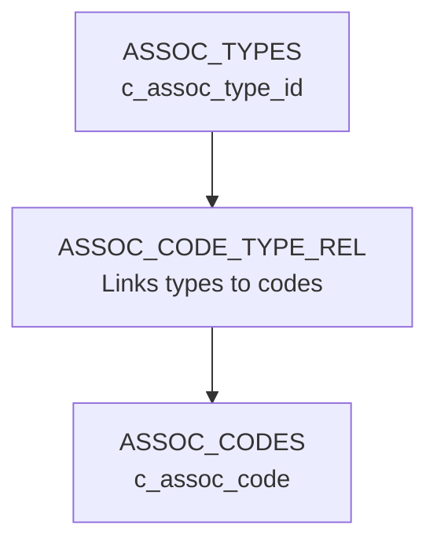

## Overview

Social associations (社會關係) record non-family relationships between people in CBDB, including:

- Teacher-student relationships
- Colleagues and professional connections
- Literary associations
- Political alliances
- Friendships and correspondences

## ASSOC_DATA Table

Social associations are stored in the `ASSOC_DATA` table:

```sql Schema
CREATE TABLE ASSOC_DATA (
    c_personid INT,
    c_assoc_id INT,
    c_assoc_code INT,
    c_assoc_name_chn VARCHAR(255),
    c_assoc_name VARCHAR(255),
    c_text_title VARCHAR(500),
    c_assoc_count INT DEFAULT 1,
    c_notes TEXT,
    PRIMARY KEY (c_personid, c_assoc_id, c_assoc_code, c_text_title),
    FOREIGN KEY (c_personid) REFERENCES BIOG_MAIN(c_personid),
    FOREIGN KEY (c_assoc_id) REFERENCES BIOG_MAIN(c_personid),
    FOREIGN KEY (c_assoc_code) REFERENCES ASSOC_CODES(c_assoc_code)
);
```

**Key fields:**
- `c_personid`: Person for whom the association is recorded ("person X")
- `c_assoc_id`: Associated person's ID ("person Y")
- `c_assoc_code`: Type of association from `ASSOC_CODES`
- `c_text_title`: Text or context where relationship is documented
- `c_assoc_count`: Number of times relationship occurs

<Note>
ASSOC_DATA uses a composite primary key of **4 fields**: `(c_personid, c_assoc_id, c_assoc_code, c_text_title)`. Always use **Query Builder** (`DB::table()`) rather than Eloquent models.
</Note>

## Adding Social Associations

<Steps>
  <Step title="Navigate to person's detail page">
    Go to `/basicinformation/{personid}` and scroll to "Social Associations" section.
  </Step>
  <Step title="Click 'Add New Association'">
    This opens the association creation form.
  </Step>
  <Step title="Select or enter associated person">
    - **Link to existing person**: Select `c_assoc_id` from BIOG_MAIN dropdown
    - **Enter name only**: Fill in `c_assoc_name_chn`/`c_assoc_name` for people not in database
  </Step>
  <Step title="Choose association type">
    Select relationship code from `ASSOC_CODES` (organized by category):
    - Academic (teacher-student, scholarly correspondence)
    - Political (colleague, patron-client)
    - Literary (poetry exchanges, preface writer)
    - Social (friend, acquaintance)
  </Step>
  <Step title="Enter context (optional)">
    - **Text Title**: Document or text where relationship is mentioned
    - **Count**: Number of times relationship occurs in sources
  </Step>
  <Step title="Add notes (optional)">
    Additional context, uncertainties, or source information.
  </Step>
  <Step title="Save association">
    Click "Save" to create the association record.
  </Step>
</Steps>

## Association Codes

The `ASSOC_CODES` table contains standardized relationship types organized hierarchically by `c_assoc_type_id`.

### Common Association Types

| Category | Code | Description (English) | Description (Chinese) |
|----------|------|----------------------|----------------------|
| Academic | 22 | Student of | 為 Y 之學生 |
| Academic | 23 | Teacher of | 為 Y 之老師 |
| Academic | 50 | Classmate of | 同窩 |
| Literary | 429 | Corresponded with | 致書 |
| Literary | 27 | Literary colleague of | 文學同僚 |
| Political | 148 | Political colleague of | 政治同事 |
| Social | 7 | Friend of | 朋友 |

<Tip>
View all association codes at `/codes/ASSOC_CODES` or browse by category using `/api/get_assoc?aType=02` (academic), `/api/get_assoc?aType=04` (political), etc.
</Tip>

## Association Code Hierarchy

Association codes are organized hierarchically using `ASSOC_CODE_TYPE_REL` and `ASSOC_TYPES` tables:



Example hierarchy:
- **02**: Academic relationships
  - **0201**: Teacher-student
  - **0202**: Scholarly exchange
  - **0203**: Examination relationships

## Directional Relationships

Many associations are directional:

<Accordion title="Example: Teacher-Student">
  If person A is the teacher of person B:
  
  **From A's perspective (teacher):**
  ```sql
  INSERT INTO ASSOC_DATA (
      c_personid, c_assoc_id, c_assoc_code
  ) VALUES (
      A_id, B_id, 23  -- "Teacher of"
  );
  ```
  
  **From B's perspective (student):**
  ```sql
  INSERT INTO ASSOC_DATA (
      c_personid, c_assoc_id, c_assoc_code
  ) VALUES (
      B_id, A_id, 22  -- "Student of"
  );
  ```
  
  Creating both directions enables bidirectional network queries.
</Accordion>

## Query Builder Usage

```php Association queries
// Create association
DB::table('ASSOC_DATA')->insert([
    'c_personid' => 12345,
    'c_assoc_id' => 67890,
    'c_assoc_code' => 22, // Student of
    'c_text_title' => '宋史本傳',
    'c_assoc_count' => 1,
]);

// Update association
DB::table('ASSOC_DATA')
    ->where('c_personid', 12345)
    ->where('c_assoc_id', 67890)
    ->where('c_assoc_code', 22)
    ->where('c_text_title', '宋史本傳')
    ->update(['c_assoc_count' => 2]);

// Find all associations for a person
$associations = DB::table('ASSOC_DATA as a')
    ->leftJoin('BIOG_MAIN as b', 'a.c_assoc_id', '=', 'b.c_personid')
    ->leftJoin('ASSOC_CODES as ac', 'a.c_assoc_code', '=', 'ac.c_assoc_code')
    ->where('a.c_personid', 12345)
    ->select(
        'a.*',
        'b.c_name_chn',
        'b.c_name',
        'ac.c_assoc_desc',
        'ac.c_assoc_desc_chn'
    )
    ->get();

// Delete association
DB::table('ASSOC_DATA')
    ->where('c_personid', 12345)
    ->where('c_assoc_id', 67890)
    ->where('c_assoc_code', 22)
    ->where('c_text_title', '宋史本傳')
    ->delete();
```

<Warning>
The composite primary key includes **c_text_title**, so you must include it in WHERE clauses for update/delete operations.
</Warning>

## Querying Social Networks

### API: Query Associates

Find people with specific associations:

```bash Query associates
curl -X POST https://input.cbdb.fas.harvard.edu/api/query_associates \
  -H "Content-Type: application/json" \
  -d '{
    "association": [22],
    "place": [101125],
    "usePeoplePlace": 1,
    "useXy": 1,
    "indexYear": 1,
    "indexStartTime": 960,
    "indexEndTime": 1250,
    "broad": 0
  }'
```

This finds all teachers (association code 22) of people in a specific location during a time period.

### API: Query Association Network

Find social networks with N-degree separation:

```bash Query network
curl -X POST https://input.cbdb.fas.harvard.edu/api/query_assoc_network \
  -H "Content-Type: application/json" \
  -d '{
    "people": [1762, 3767],
    "assocCode": [429],
    "assocType": ["02"],
    "maxNodeDist": 1,
    "includeMale": 1,
    "includeFemale": 1
  }'
```

See [API: Query Associations](/api/associations) for full documentation.

## Best Practices

<AccordionGroup>
  <Accordion title="Link to Existing People">
    - Prefer `c_assoc_id` linking to BIOG_MAIN
    - Only use name fields when associated person not in database
    - This enables network analysis and referential integrity
  </Accordion>
  
  <Accordion title="Use Appropriate Codes">
    - Select codes from correct category (academic, political, literary, social)
    - Use hierarchical structure: browse parent types to find specific codes
    - Don't create ad-hoc relationship descriptions
  </Accordion>
  
  <Accordion title="Document Context">
    - Use `c_text_title` to specify source document
    - Set `c_assoc_count` if relationship appears multiple times
    - Add notes for uncertainties or additional context
  </Accordion>
  
  <Accordion title="Create Reciprocal Relationships">
    - Add both directions for teacher-student, colleague relationships
    - Example: If A is teacher of B, also add B as student of A
    - Ensures bidirectional network queries work correctly
  </Accordion>
</AccordionGroup>

## Association vs. Kinship

| Aspect | ASSOC_DATA | KIN_DATA |
|--------|------------|----------|
| **Purpose** | Social relationships | Family relationships |
| **Examples** | Teacher, colleague, friend | Father, mother, son, daughter |
| **Primary Key** | 4 fields (includes text_title) | 2 fields |
| **Count Field** | Yes (`c_assoc_count`) | No |
| **Context** | `c_text_title` for source | `c_notes` only |

<Tip>
Use **KIN_DATA** for family relationships (father, son, wife, etc.) and **ASSOC_DATA** for all non-family social connections.
</Tip>

## Operation Logging

Association operations are logged with:

- **Operation Type**: 1 (create), 2 (update), 4 (delete)
- **Resource Type**: "Relationship Data"
- **Resource ID**: Encoded composite primary key
- **Resource Data**: Full association record in JSON

## Permissions

| Role | Create | Edit | Delete |
|------|--------|------|--------|
| Regular (0) | Proposal | Proposal | No |
| Expert (1) | Direct | Direct | Yes |
| Crowdsourcing (2) | Proposal | Proposal | No |
| Super Admin (3) | Direct | Direct | Yes |

## Related Documentation

<CardGroup cols={2}>
  <Card title="Kinship Relations" icon="people-arrows" href="/guides/kinship-relations">
    Record family relationships
  </Card>
  <Card title="Code Tables" icon="table" href="/guides/code-tables">
    Browse association codes
  </Card>
  <Card title="API: Query Associations" icon="code" href="/api/associations">
    Query social networks via API
  </Card>
  <Card title="Data Model" icon="database" href="/concepts/data-model">
    Understanding database structure
  </Card>
</CardGroup>